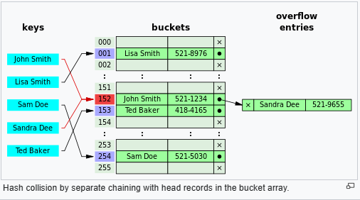
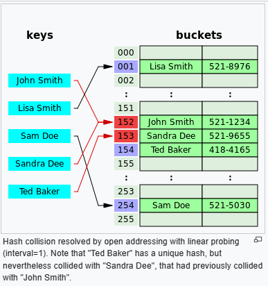

# Hash Table

In computing, a hash table, also known as a hash map or a hash set, is a data structure that implements an **associative array**, also called a *dictionary*, which is an abstract data type that maps keys to values. 

A hash table uses a hash function to compute an index, also called a **hash code**, into an array of buckets or slots, from which the desired value can be found. During lookup, the key is hashed and the resulting hash indicates where the corresponding value is stored.

Ideally, the hash function will assign each key to a unique bucket, but most hash table designs employ an imperfect hash function, which might cause hash ***collisions*** where the *hash function generates the same index for more than one key*. Such collisions are typically accommodated in some way.

## Load factor

A load factor is a critical statistic of a hash table, and is defined as follows:

load factor = \frac{{\text{{number of entries}}}}{{\text{{number of buckets}}}}

*To maintain good performance, the software makes sure the **load factor never exceeds some constant.***

Therefore a hash table is resized or rehashed whenever the load factor reaches a certain threshold.

A table is also resized if the load factor drops below a certain threshold, which can be the case if the table is gradually deleted, leaving a much smaller number of non-null entries.

### Load factor for separate chaining

With separate chaining hash tables, ***each slot of the bucket array stores a pointer to a list or array of data.***

Separate chaining hash tables suffer gradually declining performance as the load factor grows, and no fixed point beyond which resizing is absolutely needed exists.

### Load factor for open addressing

With open addressing, **each slot of the bucket array holds exactly one item**. Therefore an open-addressed hash table cannot have a load factor greater than 1.

The performance of open addressing becomes very bad when the load factor approaches 1.

Therefore a hash table that uses open addressing must be resized or rehashed if the load factor approaches 1.

With open addressing, acceptable figures of max load factor should range around 0.6 to 0.75.

## Collision resolution

A search algorithm that uses hashing consists of two parts. 
- The first part is computing a hash function which transforms the search key into an array index. The ideal case is such that no two search keys hashes to the same array index. However, this is not always the case and is impossible to guarantee for unseen given data.
- Hence the second part of the algorithm is collision resolution. 

The two common methods for collision resolution are **separate chaining** and **open addressing**.

### Separate chaining

In separate chaining, the process involves **building a linked list with key–value pair for each search array index**. 
The collided items are chained together through a single linked list, which can be traversed to access the item with a unique search key.

```
Chained-Hash-Insert(T, k)
  insert x at the head of linked list T[h(k)]

Chained-Hash-Search(T, k)
  search for an element with key k in linked list T[h(k)]

Chained-Hash-Delete(T, k)
  delete x from the linked list T[h(k)]
  ```



The linked list of separate chaining implementation **may not be cache-conscious** due to `spatial locality — locality of reference` — when the nodes of the linked list are scattered across memory, thus the list traversal during insert and search may entail CPU cache inefficiencies.

### Open addressing

Open addressing is another collision resolution technique in which every entry record is stored in the bucket array itself, and the hash resolution is performed through probing. 
- When a new entry has to be **inserted**, the buckets are examined, starting with the hashed-to slot and proceeding in some probe sequence, until an unoccupied slot is found. 
- When **searching** for an entry, the buckets are scanned in the same sequence, until either the target record is found, or an unused array slot is found, which indicates an unsuccessful search.

Well-known probe sequences include:
- **Linear probing**, in which the interval between probes is fixed (usually 1).
- **Quadratic probing**, in which the interval between probes is increased by adding the successive outputs of a quadratic polynomial to the value given by the original hash computation.
- **Double hashing**, in which the interval between probes is computed by a secondary hash function.



Since the slots are located in successive locations, open addressing could lead to better utilization of CPU cache due to locality of references resulting in reduced memory latency.